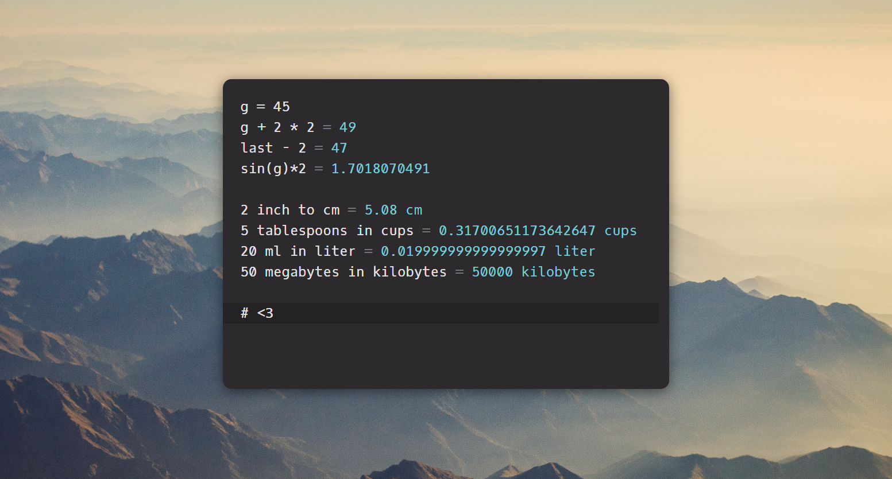
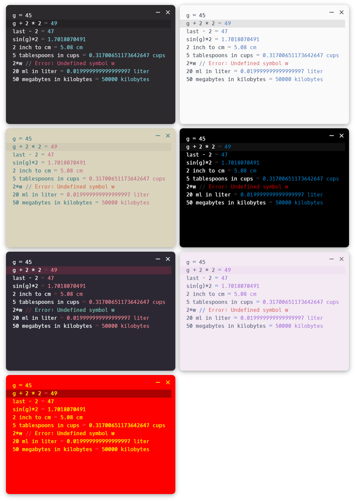

<p align="center"><br/><b>The desktop port of Calque, the reactive calculator</b></p>

Cliche screenshot on top of a royalty free mountain picure:

<p align="center"></p>

## Download

The software can be downloaded <a href="https://github.com/unplugred/calque-desktop/releases">from the Releases tab</a>
and a demo can be <a href="https://unplugred.github.io/calque-desktop/">tried here</a>

## Expressions

```
2 + 2 * 2
sqrt(3^2 + 4^2)
2 inch to cm
cos(45 deg)
```

## Variables

```
a = 25
b = a * 2
postal code = 1122
```

## Summing lists

```
animals:
  cats = 2
  dogs = 3
plants:
  trees = 20
  vegetables:
    potatoes = 10
    carrots = 10
```

## Functions

```
pow2(x) = x ^ 2
pow2(6)
```

## Last result

```
2 * 2
last + 1
```

## Themes

CSS overrides can be done by creating a file at:

- ~/.config/Calque/theme.css on Linux

- %appdata%/Calque/theme.css on Windows

- ~/Library/Application Support/Calque/theme.css on MacOS

Themes can be changed via the right click menu.

<p align="center"></p>

## Keys

Duplicate line or selection: Ctrl+D

Change selected number: Up/Down

Change selected number 10x: Shift+Up/Down

Change indent: Tab/Shift+Tab

Zoom in: Ctrl+Shift+Plus

Zoom out: Ctrl+Minus

## To do

- File open / save / open as / save as

- Mac codesigning

- Currency conversion

## Technologies

Fork of Calque:

https://github.com/grimalschi/calque

Using Math.js:

https://github.com/grimalschi/mathjs
