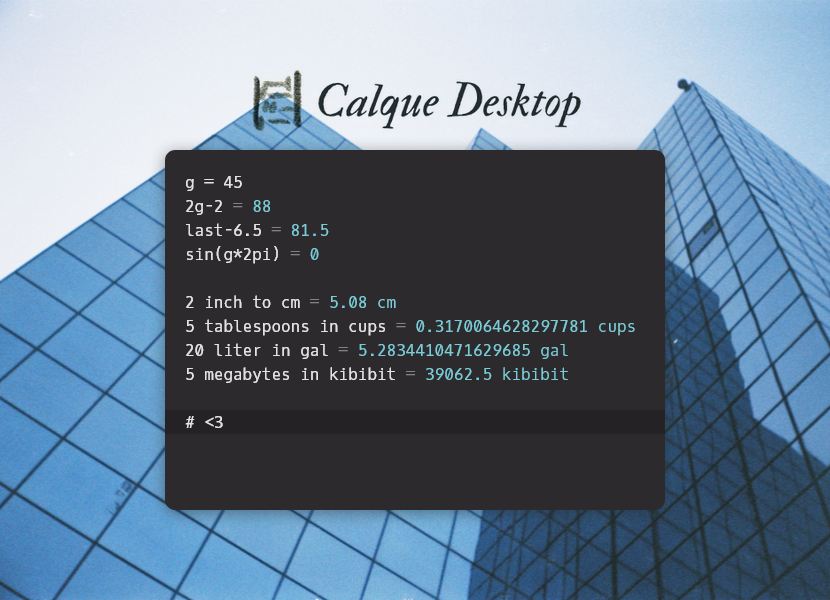

<center></center>

<center>**the desktop port of calque, the reactive calculator**</center>

## download

the software can be downloaded <a href="https://github.com/unplugred/calque-desktop/releases">from the releases tab</a>
and a demo can be <a href="https://unplugred.github.io/calque-desktop/">tried here</a>

## contains:

### expressions

```
2 + 2 * 2
sqrt(3^2 + 4^2)
2 inch to cm
cos(45 deg)
```

### variables

```
a = 25
b = a * 2
postal code = 1122
```

### summing lists

```
animals:
  cats = 2
  dogs = 3
plants:
  trees = 20
  vegetables:
    potatoes = 10
    carrots = 10
```

### functions

```
pow2(x) = x ^ 2
pow2(6)
```

### last result

```
2 * 2
last + 1
```

## themes

CSS overrides can be done by creating a file at:

- ~/.config/Calque/theme.css on linux

- %appdata%/Calque/theme.css on windows

- ~/Library/Application Support/Calque/theme.css on macos

themes can be changed via the right click menu.

<p align="center"></p>

## keys

duplicate line or selection: ctrl+d

change selected number: up/down

change selected number 10x: shift+up/down

change indent: tab/shift+tab

zoom in: ctrl+shift+plus

zoom out: ctrl+minus

## to do

- file open / save / open as / save as

- mac codesigning

- currency conversion

## technologies

fork of calque:

https://github.com/grimalschi/calque

using math.js:

https://github.com/grimalschi/mathjs

## license

everything is under MIT except for the website picture which i reserve the rights for
